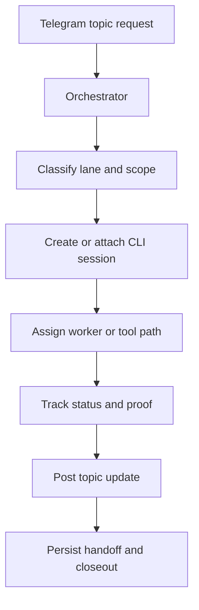

# CLI Session Orchestrator

A public-safe operating kit for an agent like Enoch to manage long-running CLI coding sessions and coordinate them clearly through Telegram topics.

This repo is not a private runtime dump. It is the reusable architecture: session registry, topic routing, handoff packets, status updates, worker assignment, verification gates, and a small reference CLI.

## Problem

When multiple CLI agents are working at once, humans lose track of:

- which session owns which task
- which terminal or host is active
- whether a worker is alive, blocked, or stale
- which Telegram topic should receive updates
- what proof exists before a task is called complete
- how to resume or close old sessions safely

The orchestrator fixes this by keeping a session ledger and translating agent activity into clear topic-scoped updates.

## Operating model



## Start here

- `docs/implementation-blueprint.md`: how to wire the orchestrator into a real agent.
- `docs/orchestrator-architecture.md`: core design.
- `docs/session-state-machine.md`: states, transitions, and required evidence.
- `docs/telegram-topic-coordination.md`: topic lane rules and message patterns.
- `docs/cli-session-ledger.md`: registry schema and lifecycle.
- `docs/worker-dispatch.md`: when to answer directly, resume, spawn, or delegate.
- `docs/escalation-matrix.md`: approval gates and high-risk boundaries.
- `docs/command-reference.md`: CLI commands and examples.
- `docs/handoff-protocol.md`: worker handoff and closeout packets.
- `docs/verification-and-safety.md`: gates before commit, push, deploy, or public output.
- `checklists/orchestrator-readiness.md`: install and runtime checklist.
- `prompts/enoch-orchestrator.md`: drop-in agent prompt.
- `scripts/session_orchestrator.py`: small local reference CLI.

## Reference CLI

```bash
python3 scripts/session_orchestrator.py init --state .orchestrator/state.json
python3 scripts/session_orchestrator.py create --state .orchestrator/state.json --topic ops --task "Investigate failing tests" --owner enoch
python3 scripts/session_orchestrator.py list --state .orchestrator/state.json
python3 scripts/session_orchestrator.py update --state .orchestrator/state.json --session <id> --status blocked --note "Needs credentials approval"
python3 scripts/session_orchestrator.py close --state .orchestrator/state.json --session <id> --verdict verified --proof "pytest passed"
python3 scripts/session_orchestrator.py topic-update --state .orchestrator/state.json --session <id> --kind progress
python3 scripts/session_orchestrator.py stale --state .orchestrator/state.json --minutes 60
```

## Minimum viable install

1. Create a private topic routing config from `config/orchestrator.example.yaml`.
2. Start a session ledger with `scripts/session_orchestrator.py init`.
3. Register every spawned CLI session with `create`.
4. Post only template-shaped updates back to Telegram.
5. Require proof before moving a session to `verified` or `closed`.
6. Run `stale` periodically to find sessions that need attention.

## Public-safety boundary

This repo intentionally omits:

- real Telegram chat IDs or thread IDs
- private hostnames or SSH aliases
- customer rosters
- runtime paths
- API keys, tokens, cookies, or credentials
- raw transcripts or logs

Use logical topic names in public examples, then bind them to real destinations in private config.
